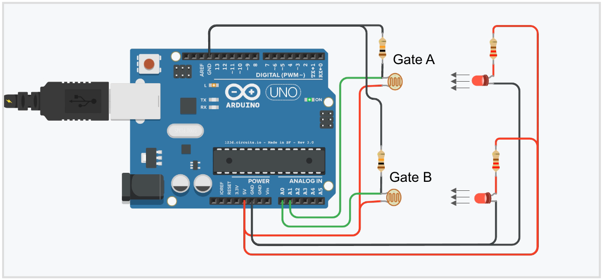

# Hardware part of Smart foosball IoT

Hardware part of Smart foosball fixes Goal events and send it over serial port. It consists of:

* Arduino UNO-like board
* 2 Laser dot diode module
* 2 Photoresistor (for example VT90N2)
* 2 Resistors (for example 100 kΩ)
* USB cable (A — B)
* OTG cable (USB-B - microUSB)

**NOTEs:** 
* Laser dot diode module will be connected to Arduino 5V so please check that this modules have appropriate resistors. If no, you have to add this resistors in your scheme manualy.
* Electrical resistence of resistors should be calculated based on choosen photoresistor. It must be approximately equal to resistence of photoresisor in lighted room.

Scheme of connection:

Photoresistors must be placed in gates, lasers must be placed near and point to them. When ball get in gate, it have to break line between laser and photoresistor. Photoresistor will change thier resistence and Arduino board will be able to fix this and recognize a Goal event.

This part of project was developed in [PlatformIO IDE](http://platformio.org/platformio-ide). It's much more сonvenient and effective tool that Arduino IDE, but you could copy-paste all content from files from src dir to Arduino IDE project.

Scetch reads signals from analogs port, fixes goals based on this information and send Goal event through serial port. Android part parses it and counts goals.